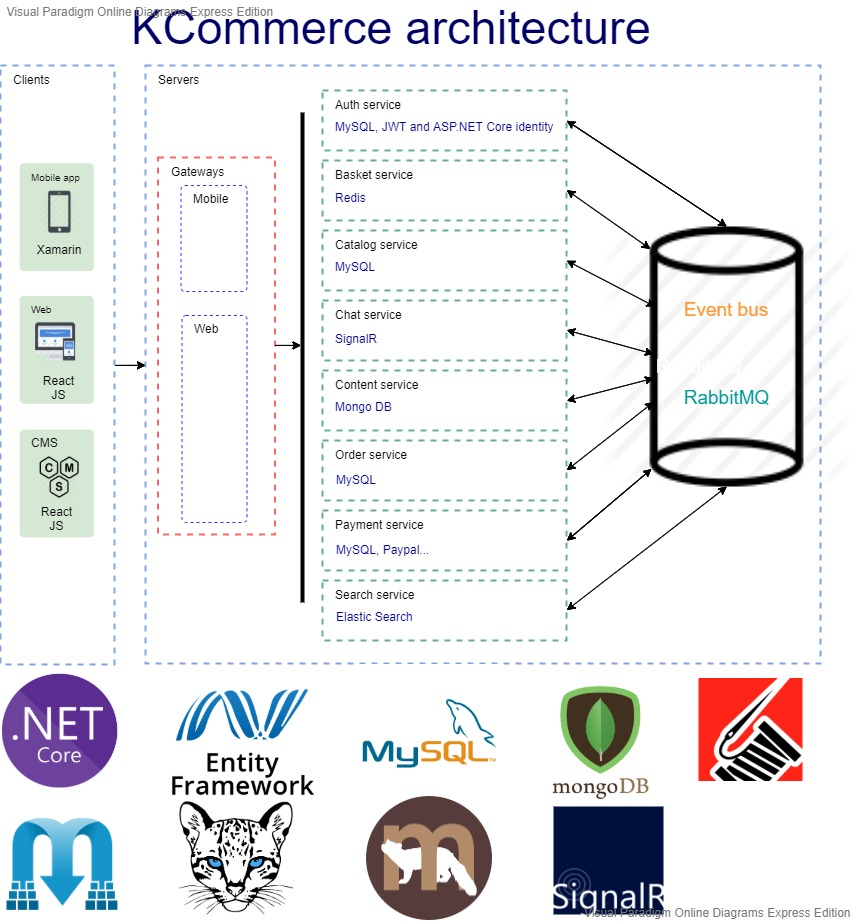

# Microservices
The <b>KCommerce</b> project is about commerce, of course. There are 4 main parts: 
 1. Web: basically the pages for users to find and pick up products that they want to buy
 2. CMS: the pages for admin to add products, content… (these data will be display on Web page)
 3. Mobile app: the same functions as Web pages, but in native mobile app
 4. Services: use Microservices architecture to buid many microservices for the three parts above
 
 Solution architecture:
  

